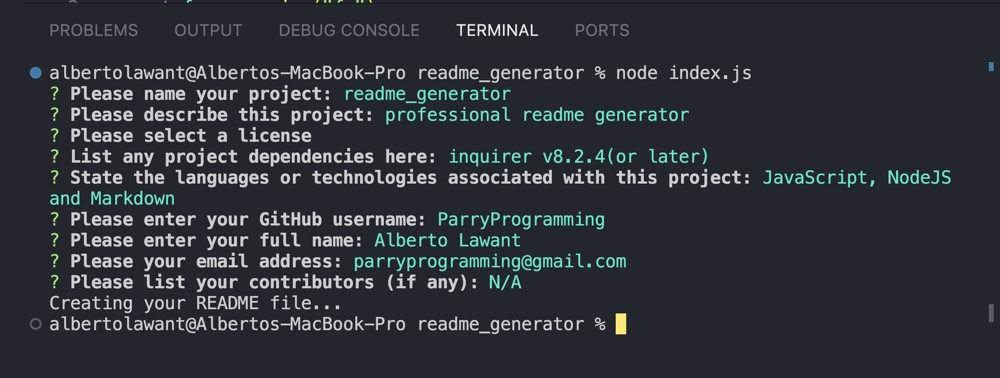

# readme_generator

## Description

README generator for professionals to create quick README files for faster workflow.

- Improved workflow.
- Quick and easy README's.
- Spend more time coding, less time creating README's.

## Example

## Links

Github - [Click Here](https://github.com/ParryProgramming/readme_generator)
